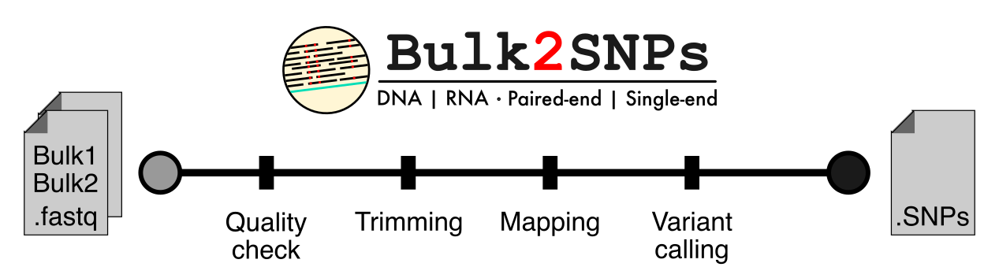

---
Bulk2SNPs is an automated pipeline to speed up SNP discovery from next-generation sequencing data, i.e., DNA and RNA, generated from contrasting bulks to map quantitative trait loci (QTLs) for desired traits. 

## Features:
- No software installation required (docker/singularity containers are implemented)
- No bioinformatics expertise required
- Fast and reproducible
- Bam and index files are provided for visualization in any genome viewer
- Provide SNPs table for downstream analysis with QTLseqR

## Usage: 
#### STEP I: Install docker and keep it running in the background
```md
Download the docker software based on your operating system from
https://www.docker.com
```

#### STEP II: Clone the Bulk2SNPs repo inside the folder created in STEP I 
```bash
git clone https://github.com/NDSUrustlab/Bulk2SNPs.git
```

#### STEP III: Prepare your data
```md
a) Now you will have a folder called: Bulk2SNPs
b) Inside this folder create two more folder:
   i) data
  ii) genome or index (if you have index already generated)
c) paste your illumina data in `data` folder and your genome files,
   such as fasta and gff3 (only for RNAseq data) files in `genome` folder

Now, your folder structure will be as follows:

├── Docker
├── README.md
├── data
│   ├── Bulk1_1.fastq
│   ├── Bulk1_2.fastq
│   ├── Bulk2_1.fastq
│   └── Bulk2_2.fastq
├── genome
│   ├── annotation.gff
│   └── genome.fasta
├── main.nf
├── media
├── modules
└── nextflow
```

#### STEP IV: Run the pipeline 
On local machine:
```bash
chmod +x nextflow
docker pull jtndr/bulk2snps:latest
```

```bash
./nextflow run main.nf -with-docker \
  --bulk1 'Bulk1' \
  --bulk2 'Bulk2' \
  --genome 'genome.fasta' \
  --gff3 'annotation.gff3
```

On High Performance Computing (HPC) clusters:
```bash
chmod +x nextflow
singularity pull bulk2snps.sif docker://jtndr/bulk2snps:latest
```

```bash
./nextflow run main.nf -with-singularity bulk2snps.sif \
  --bulk1 'Bulk1' \
  --bulk2 'Bulk2' \
  --genome 'genome.fasta' \
  --gff3 'annotation.gff3
```

## Parameters:
```bash
==============================================
========= B u l k 2 S N P s Pipeline =========
==============================================
   Usage:
   nextflow run main.nf --bulk1 <Bulk1_name> --bulk2 <Bulk2_name> 
                        --genome <genome_dir> --gff <annotation.gff3>

   Parameters:
   --bulk1        Name of bulk1 [required]
   --bulk2        Name of bulk2 [required]
   --reads        Path to the raw reads [default: data/]
   --genome       Path to the reference genome directory [required]
   --gff          Path to the annotations directory [required]
   --index        Path to the genome index directory
   --datatype     Type of data DNA or RNA [default: DNA]
   --seqtype      Type of sequencing used, paried-end (PE) or single end (SE) [default: PE]
   --outdir       Name of the output directory [default: results/]
   --help         Display this help message
```

## Output files:
You will have 6 folders in the output directory (default: results)
```md
├── final_SNPs
│   ├── Bulks_SNPs.table  ## Use this file for downstream QTL mapping with QTLseqR
│   └── Bulks_SNPs.vcf
├── index  ## Based on you data (DNA/RNA), you can use this index directory for future analysis
├── mapped
│   ├── Bulk1.sorted.bam
│   ├── Bulk1.sorted.bam.csi
│   ├── Bulk2.sorted.bam
│   └── Bulk2.sorted.bam.csi
├── quality_reports
│   └── multiqc_report.html
├── trimmed_reads
│   ├── Bulk1_1_trim.fq.gz
│   ├── Bulk1_2_trim.fq.gz
│   ├── Bulk2_1_trim.fq.gz
│   └── Bulk2_2_trim.fq.gz
└── variant_calling
    ├── Bulk1.g.vcf
    ├── Bulk2.g.vcf
    └── Bulks.vcf
```
## Example use cases:
### If you are running the pipeline for second time and using the same genome and data type (DNA or RNA), you can use `index` folder from previous run.
#### 1) Paired-end DNA sequencing data
```bash
./nextflow run main.nf -with-singularity ./Bulk2SNPs.sif \ ## use `-with-docker` for local machine
    --bulk1 'Bulk1Name' \
    --bulk2 'Bulk2Name' \
    --genome 'genome/genome.fasta'
```
#### 2) Paired-end RNA sequencing data
```bash
./nextflow run main.nf -with-singularity ./Bulk2SNPs.sif \ ## use `-with-docker` for local machine
    --datatype 'RNA' \
    --bulk1 'Bulk1Name' \
    --bulk2 'Bulk2Name' \
    --genome 'genome/genome.fasta' \
    --gff 'genome/annotation.gff'
```
#### 3) Single-end DNA sequencing data
```bash
./nextflow run main.nf -with-singularity ./Bulk2SNPs.sif \ ## use `-with-docker` for local machine
    --seqtype 'SE' \
    --bulk1 'Bulk1Name' \
    --bulk2 'Bulk2Name' \
    --genome 'genome/genome.fasta'
```
#### 4) Single-end RNA sequencing data
```bash
./nextflow run main.nf -with-singularity ./Bulk2SNPs.sif \ ## use `-with-docker` for local machine
    --datatype 'RNA' \
    --seqtype 'SE' \
    --bulk1 'Bulk1Name' \
    --bulk2 'Bulk2Name' \
    --genome 'genome/genome.fasta' \
    --gff 'genome/annotation.gff'
```

Use `-resume` to start failed run from the same point where it fail.

## Here's the flowdiagram depicting pipeline's workflow

