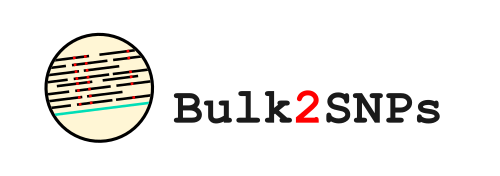

---
Bulk2SNPs is an automated pipeline to speed up SNP discovery from next-generation sequencing data, i.e., DNA and RNA, generated from contrasting bulks to map quantitative trait loci (QTLs) for desired traits. 

### Example usage:
```bash
nextflow run main.nf \
  --bulk1 'Bulk1Name' \
  --bulk2 'Bulk2Name' \
  --genome 'genome.fasta' \
  --gff3 'annotation.gff3
```

## Here's the flowdiagram depicting pipeline's workflow

